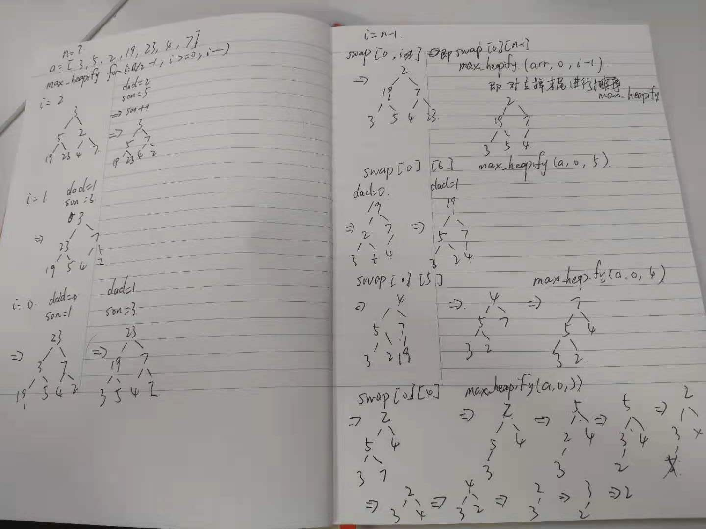

### heap sort
1. 基数排序的定义 指利用堆这种数据结构所设计的一种排序算法。堆是一个近似完全二叉树的结构，并同时满足堆的性质：即子节点的键值或索引总是小于（或者大于）它的父节点。
2. 堆节点的访问
    通常堆是通过一维数组来实现的。在数组起始位置为0的情形中：
    父节点i的左子节点在位置(2i+1);
    父节点i的右子节点在位置(2i+2);
    子节点i的父节点在位置floor((i-1)/2);
3. 堆的操作
    * 在堆的数据结构中，堆中的最大值总是位于根节点（在优先队列中使用堆的话堆中的最小值位于根节点）。堆中定义以下几种操作：
        1. 最大堆调整（Max Heapify）：将堆的末端子节点作调整，使得子节点永远小于父节点
            1. 单独的Max heapify操作只是确保子节点小于父节点
        2. 创建最大堆（Build Max Heap）：将堆中的所有数据重新排序
        3. 堆排序（HeapSort）：移除位在第一个数据的根节点，并做最大堆调整的递归运算
3. [heap sort code](../algorithm/sort/sort_test.go)
4. 时间空间复杂度
    1. 时间复杂度:
        * 为O(n*log(n)) 
    2. 空间复杂度: 
        * O(n)

### 运算步骤示例


### 优点
堆排序的优点是通过堆结构一定程度上记住了比较结果

### 缺点


### bench测试
[code](../algorithm/sort/sort_test.go)

```sh
BenchmarkQuick
BenchmarkQuick-12          	1000000000	         0.127 ns/op
BenchmarkRandomQuick
BenchmarkRandomQuick-12    	1000000000	         0.111 ns/op
BenchmarkMerge
BenchmarkMerge-12          	1000000000	         0.198 ns/op
BenchmarkRadix
BenchmarkRadix-12          	1000000000	         0.306 ns/op
BenchmarkHeap
BenchmarkHeap-12           	1000000000	         0.171 ns/op
```

### 参考
[维基百科-堆排序](https://zh.wikipedia.org/wiki/%E5%A0%86%E6%8E%92%E5%BA%8F)
[动画示例](https://visualgo.net/en/heap)
[heapsort from happy coders](https://www.happycoders.eu/algorithms/heapsort/)